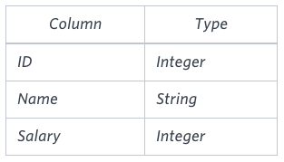

# The Blunder

### Problem

Samantha was tasked with calculating the average monthly salaries for all employees in the **EMPLOYEES** table, but did not realize her keyboard's $0$ key was broken until after completing the calculation. She wants your help finding the difference between her miscalculation (using salaries with any zeros removed), and the actual average salary.

Write a query calculating the amount of error (i.e.: $actual - miscalculated$ average monthly salaries), and round it up to the next integer.

### **Input Format**

The **EMPLOYEES** table is described as follows:



**Note:** *Salary* is per month.

### **Constraints**

$1000 < Salary < 10^5.$

### **Sample Input**


### **Sample Output**

```
2061
```

### **Explanation**

The table below shows the salaries *without zeros* as they were entered by Samantha:


Samantha computes an average salary of $98.00$. The *actual* average salary is $2159.00$.

The resulting error between the two calculations is $2159.00 - 98.00 = 2061.00$. Since it is equal to the integer $2061$, it does not get rounded up.

[문제 링크](https://www.hackerrank.com/challenges/the-blunder/problem?isFullScreen=true)

### Lessons Learned

- REPLACE(string, from_substring, to_substring)
    - 문자열 내에서 특정 문자열을 다른 문자열로 대체
    - REPLACE 함수는 입력 데이터가 숫자형이라도 처리 가능
    - string: 대체 작업 수행할 원본 문자열 또는 컬럼
    - from_substring: 문자열 내에서 대체될 문자열
    - to_substring: 대체할 문자열
- **숫자형 연산의 암묵적 변환**
    - 숫자형 함수(AVG, SUM, MAX, MIN 등)는 입력 데이터가 문자열이라도, 숫자 연산이 가능한 문자열은 내부적으로 숫자로 처리
    - 따라서, REPLACE 함수로 숫자형을 처리하면 문자열로 반환되는데 AVG 함수에 입력할 때 암묵적으로 숫자형으로 인식 됨