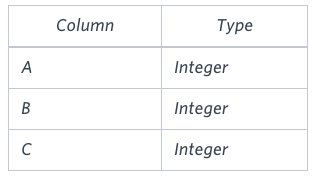

# Type of Triangle

### Problem

Write a query identifying the *type* of each record in the **TRIANGLES** table using its three side lengths. Output one of the following statements for each record in the table:

- **Equilateral**: It's a triangle with  sides of equal length.
- **Isosceles**: It's a triangle with  sides of equal length.
- **Scalene**: It's a triangle with  sides of differing lengths.
- **Not A Triangle**: The given values of *A*, *B*, and *C* don't form a triangle.

### Input Format

The **TRIANGLES** table is described as follows:



Each row in the table denotes the lengths of each of a triangle's three sides.

### **Sample Input**


### **Sample Output**

```
Isosceles
Equilateral
Scalene
Not A Triangle
```

### **Explanation**

Values in the tuple $(20, 20, 23)$ form an Isosceles triangle, because $A = B$.

Values in the tuple $(20, 20, 20)$ form an Equilateral triangle, because . Values in the tuple  form a Scalene triangle, because $A = B = C$.

Values in the tuple $(13, 14, 30)$ cannot form a triangle because the combined value of sides $A$ and $B$ is not larger than that of side $C$.

[문제 링크](https://www.hackerrank.com/challenges/what-type-of-triangle/problem?isFullScreen=true)

### Lessons Learned

- 삼각형이 되기 위한 조건
    - 각 변의 길이 모두 양수
    - 두 변의 길이의 합이 나머지 변의 길이보다 커야 함
    -