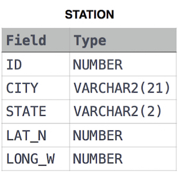

# Weather Observation Station 8

### Problem

Query the list of *CITY* names from **STATION** which have vowels (i.e., *a*, *e*, *i*, *o*, and *u*) as both their first *and* last characters. Your result cannot contain duplicates.

### Input Format

The **STATION** table is described as follows:

where *LAT_N* is the northern latitude and *LONG_W* is the western longitude.

[문제 링크](https://www.hackerrank.com/challenges/weather-observation-station-8/problem?isFullScreen=true)