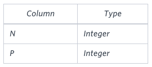

# Binary Tree Nodes

### Problem

You are given a table, *BST*, containing two columns: *N* and *P,* where *N* represents the value of a node in *Binary Tree*, and *P* is the parent of *N*.



Write a query to find the node type of *Binary Tree* ordered by the value of the node. Output one of the following for each node:

- *Root*: If node is root node.
- *Leaf*: If node is leaf node.
- *Inner*: If node is neither root nor leaf node.

### **Sample Input**


### **Sample Output**

```
1 Leaf
2 Inner
3 Leaf
5 Root
6 Leaf
8 Inner
9 Leaf
```

### **Explanation**

The *Binary Tree* below illustrates the sample:


### Input Format

[문제 링크](https://www.hackerrank.com/challenges/binary-search-tree-1/problem?isFullScreen=true)

### Lessons Learned

- CASE 문
    - 특정 조건을 기반으로 값을 반환
    - FROM 절에서 가져온 테이블의 모든 행에 대해 조건을 평가 즉, 각 행마다 개별적으로 평가
    - 특정 컬럼에 대해서만 수행하면 간단 CASE 문
    - 여러 컬럼이나 조건을 조합하면 검색 CASE 문
    - 주의사항
        - 간단 CASE 문과 검색 CASE 문을 한 CASE 문 안에 혼용할 수 없음
        - 조건을 위에서부터 평가하므로, 더 구체적인 조건이 먼저 나와야 함
        - Null 값을 명시적으로 처리해야 함
    - **간단 CASE 문**
        - 기본 구조
            
            ```sql
            CASE column_name
            	WHEN value1 THEN result1
            	WHEN value2 THEN result2
            	ELSE default_result
             END
            ```
            
        - 예제
            
            ```sql
            SELECT  order_id,
                    CASE delivery_status
                        WHEN 'pending' THEN 'Order pending'
                        WHEN 'completed' THEN 'Order completed'
                        ELSE 'Unknown Status'
                     END AS delivery_status
              FROM  orders;
            ```
            
    - **검색 CASE 문**
        - 기본 구조
            
            ```sql
            CASE
                WHEN condition1 THEN result1
                WHEN condition2 THEN result2
                ELSE default_result
             END
            ```
            
        - 예제
            
            ```sql
            SELECT  employee_id,
                    CASE
                        WHEN salary > 5 AND department = 'IT' THEN 'High IT Salary'
                        WHEN salary <= 5 AND department = 'HR' THEN 'HR Average Salary'
                        ELSE 'Other'
                     END AS salary_category
              FROM  employees;
            ```
            
- **IN 연산자**
    - **역할**
        - 특정 값이 리스트 안에 있는지 확인
    - **동작**
        - 리스트 안의 값과 비교하여 하나라도 일치하면 `TRUE`를 반환
        - 리스트에 `NULL`이 포함되어 있어도 무시되며, 하나라도 일치하면 `TRUE`
        - 결과가 `NULL` 때문에 왜곡되지 않음
    - **특이사항**
        - 비교 값 자체가 `NULL`일 경우, 결과는 `UNKNOWN`
    - **예시**
        
        ```sql
        SELECT 1 IN (1, 2, NULL);     -- 결과: TRUE (1이 리스트에 있음)
        SELECT 3 IN (1, 2, NULL);     -- 결과: FALSE (3이 리스트에 없음)
        SELECT NULL IN (1, 2, NULL);  -- 결과: UNKNOWN (비교값 자체가 NULL이면 UNKNOWN)
        ```
        
- **NOT IN 연산자**
    - **역할**
        - 특정 값이 리스트 안의 모든 값과 불일치해야 `TRUE` 반환
    - **동작**
        - 리스트에 `NULL` 값이 포함되면, 비교 결과는 항상 `UNKNOWN`
        - 특정 값이 리스트에 없더라도, 리스트에 `NULL`이 있으면 신뢰할 수 없는 결과를 반환
    - **특이사항**
        - 리스트에서 하나라도 `NULL`이 포함되면 추가 조건으로 `WHERE ... IS NOT NULL`을 사용해야 올바르게 동작
    - **예시**
        
        ```sql
        SELECT 1 NOT IN (1, 2, NULL);  -- 결과: UNKNOWN (1이 리스트에 있지만, NULL이 있음)
        SELECT 3 NOT IN (1, 2, NULL);  -- 결과: UNKNOWN (리스트에 NULL이 있음)
        SELECT 5 NOT IN (1, 2);        -- 결과: TRUE (5는 리스트에 없음)
        SELECT NULL NOT IN (1, NULL);  -- 결과: UNKNOWN (리스트에 NULL 있음)
        ```