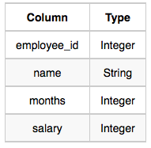

# Employee Salaries

### **Problem**

Write a query that prints a list of employee names (i.e.: the *name* attribute) for employees in **Employee** having a salary greater than  per month who have been employees for less than  months. Sort your result by ascending *employee_id*.

### **Input Format**

The **Employee** table containing employee data for a company is described as follows:



where *employee_id* is an employee's ID number, *name* is their name, *months* is the total number of months they've been working for the company, and *salary* is the their monthly salary.

### **Sample Input**


### **Sample Output**

`Angela
Michael
Todd
Joe`

### **Explanation**

*Angela* has been an employee for  month and earns  per month.

*Michael* has been an employee for  months and earns  per month.

*Todd* has been an employee for  months and earns  per month.

*Joe* has been an employee for  months and earns  per month.

We order our output by ascending *employee_id*.

### Submission

```sql
SELECT  NAME
  FROM  EMPLOYEE
 WHERE  SALARY > 2000
   AND  MONTHS < 10
 ORDER
    BY  EMPLOYEE_ID ASC;
```
[문제 링크](https://www.hackerrank.com/challenges/salary-of-employees/problem?isFullScreen=true)