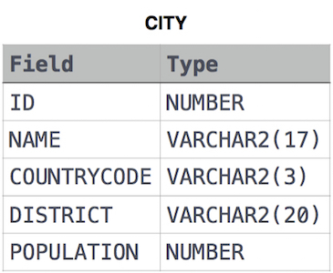

# Select All

### Problem

Query all columns (attributes) for every row in the **CITY** table.

### Input Format

The **CITY** table is described as follows:



### Submission

```sql
SELECT  *
  FROM  CITY;
```

[문제 링크](https://www.hackerrank.com/challenges/select-all-sql/problem?isFullScreen=true)