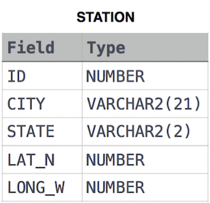

# Weather Observation Station 3

### Problem

Query a list of **CITY** names from **STATION** for cities that have an even **ID** number. Print the results in any order, but exclude duplicates from the answer.

### Input Format

The **STATION** table is described as follows:

where **LAT_N** is the northern latitude and **LONG_W** is the western longitude.

[문제 링크](https://www.hackerrank.com/challenges/weather-observation-station-3/problem?isFullScreen=true)

### Lessons Learned

- MOD(x, y)
    - 나눗셈의 나머지 값을 반환하는 함수
    - x: 나눠지는 값
    - y: 나누는 값
- x DIV y
    - 나눗셈의 몫을 구하는 연산자
    - x: 나눠지는 값
    - y: 나누는 값