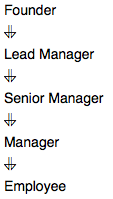

# New Companies

### Problem

Amber's conglomerate corporation just acquired some new companies. Each of the companies follows this hierarchy:



Given the table schemas below, write a query to print the *company_code*, *founder* name, total number of *lead* managers, total number of *senior* managers, total number of *managers*, and total number of *employees*. Order your output by ascending *company_code*.

### **Note:**

- The tables may contain duplicate records.
- The *company_code* is string, so the sorting should not be **numeric**. For example, if the *company_codes* are *C_1*, *C_2*, and *C_10*, then the ascending *company_codes* will be *C_1*, *C_10*, and *C_2*.

---

### **Input Format**

The following tables contain company data:

- *Company:* The *company_code* is the code of the company and *founder* is the founder of the company.


- *Lead_Manager:* The *lead_manager_code* is the code of the lead manager, and the *company_code* is the code of the working company.


- *Senior_Manager:* The *senior_manager_code* is the code of the senior manager, the *lead_manager_code* is the code of its lead manager, and the *company_code* is the code of the working company.


- *Manager:* The *manager_code* is the code of the manager, the *senior_manager_code* is the code of its senior manager, the *lead_manager_code* is the code of its lead manager, and the *company_code* is the code of the working company.


- *Employee:* The *employee_code* is the code of the employee, the *manager_code* is the code of its manager, the *senior_manager_code* is the code of its senior manager, the *lead_manager_code* is the code of its lead manager, and the *company_code* is the code of the working company.


---

### **Sample Input**

*Company* Table:


*Lead_Manager* Table:


*Senior_Manager* Table:


*Manager* Table:


*Employee* Table:


### **Sample Output**

```
C1 Monika 1 2 1 2
C2 Samantha 1 1 2 2
```

### **Explanation**

In company *C1*, the only lead manager is *LM1*. There are two senior managers, *SM1* and *SM2*, under *LM1*. There is one manager, *M1*, under senior manager *SM1*. There are two employees, *E1* and *E2*, under manager *M1*.

In company *C2*, the only lead manager is *LM2*. There is one senior manager, *SM3*, under *LM2*. There are two managers, *M2* and *M3*, under senior manager *SM3*. There is one employee, *E3*, under manager *M2*, and another employee, *E4*, under manager, *M3*.

[문제 링크](https://www.hackerrank.com/challenges/the-company/problem?isFullScreen=true)

### Lessons Learned

### 1. **RIGHT JOIN 문제점**

`RIGHT JOIN`은 오른쪽 테이블의 모든 행을 유지하며, 왼쪽 테이블에 대응되는 값이 없으면 `NULL`로 채운다.

- `COMPANY.COMPANY_CODE`에 없는 값이 `LEAD_MANAGER.COMPANY_CODE`에 있다면, `COMPANY_CODE`가 `NULL`인 레코드가 생성된다.
- 이런 상황에서 `GROUP BY COMPANY.COMPANY_CODE`를 수행하면, `NULL`이 포함된 그룹이 생성될 수 있다.
- `NULL` 값은 데이터 분석에서 혼란을 초래하거나 불필요한 데이터를 포함할 가능성이 크다

### 2. **INNER JOIN 선택 이유**

`INNER JOIN`은 양쪽 테이블에 매칭되는 레코드만 반환하기 때문에, `COMPANY_CODE`가 양쪽 테이블에 모두 존재해야만 결과에 포함된다.

- `INNER JOIN`을 사용하면 `NULL` 값이 포함된 레코드가 생기지 않으므로 데이터 무결성이 유지된다
- 각 회사에 대한 리더와 직원 계층 수를 정확히 계산하려면 `INNE JOIN` 을 사용해야 한다.