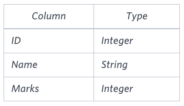

# The Report

### Problem

You are given two tables: *Students* and *Grades*. *Students* contains three columns *ID*, *Name* and *Marks*.



*Grades* contains the following data:


*Ketty* gives *Eve* a task to generate a report containing three columns: *Name*, *Grade* and *Mark*. *Ketty* doesn't want the NAMES of those students who received a grade lower than *8*. The report must be in descending order by grade -- i.e. higher grades are entered first. If there is more than one student with the same grade (8-10) assigned to them, order those particular students by their name alphabetically. Finally, if the grade is lower than 8, use "NULL" as their name and list them by their grades in descending order. If there is more than one student with the same grade (1-7) assigned to them, order those particular students by their marks in ascending order.

Write a query to help Eve.

### **Sample Input**


### **Sample Output**

```
Maria 10 99
Jane 9 81
Julia 9 88
Scarlet 8 78
NULL 7 63
NULL 7 68
```

### **Note**

Print "NULL"  as the name if the grade is less than 8.

### **Explanation**

Consider the following table with the grades assigned to the students:


So, the following students got *8*, *9* or *10* grades:

- *Maria (grade 10)*
- *Jane (grade 9)*
- *Julia (grade 9)*
- *Scarlet (grade 8)*

[문제 링크](https://www.hackerrank.com/challenges/the-report/problem?isFullScreen=true)

### Lessons Learned

- UNION 또는 UNION ALL 정렬
    - `UNION` 또는 `UNION ALL`에서 `ORDER BY`**는 전체 결과에 대해 한 번만 작성.** 즉, `ORDER BY`는 `UNION`으로 결합된 마지막 `SELECT` 절 뒤에 작성
    - 개별 `SELECT` 절에 `ORDER BY`를 작성하려고 하면 문법 오류가 발생
- UNION 또는 UNION ALL 별칭(alias) 접근 제한
    - `UNION`이나 `UNION ALL`의 `ORDER BY` 절에서 별칭(alias)로 접근이 제한됨
    - `ORDER BY`는 두 개 이상의 `SELECT` 결과를 결합한 **전체 결과 집합**을 대상으로 동작하기 때문
    - 여기에서 각각의 `SELECT` 절은 독립적으로 작동하므로, 개별적으로 정의된 테이블 별칭이나 컬럼 이름은 전역적인 컨텍스트에서 직접 접근할 수 없음
- UNION vs UNION ALL
    - UNION
        - **중복 제거**: 결과 집합에서 중복된 행을 제거
        - **비교 작업 추가**: 중복 제거를 위해 SQL 엔진이 각 행을 비교하므로 더 많은 계산 작업이 필요
        - **정렬 수행**: 중복 제거 과정에서 암묵적으로 정렬이 수행됨
        - **느릴 수 있음**: 추가 작업 때문에 `UNION ALL`보다 성능이 낮을 수 있음
    - UNION ALL
        - **중복 제거 없음**: 결과 집합에서 중복된 행을 제거 안 함
        - **비교 작업 없음**: 중복 제거 작업이 없으므로 성능이 더 빠름
        - **순서 유지**: 각 쿼리의 결과 순서가 유지.
        - **빠름**: 추가 작업이 없으므로 `UNION`보다 효율적